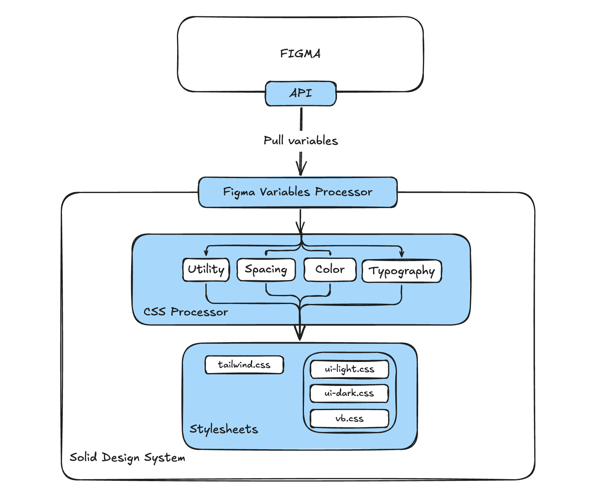

# Figma Variables Processing & Tailwind v4 Build Pipeline

This package provides an automated pipeline to:

- Fetch variables from Figma
- Process them using a custom token engine
- Generate Tailwind v4–compatible CSS
- Extract themes and component utilities
- Produce distributable CSS and SCSS variable mappings

---

## Architecture Overview

The system converts **Figma Variables → Processed Tokens → Tailwind v4 CSS → Theme Outputs**.



---

## 1. Pulling Variables from Figma

Before running the build, variables need to be pulled from Figma.

To do so, generate a Figma Token with permissions to pull variables and then run the following commands:

```bash
cd packages/tokens
FIGMA_TOKEN=<your-token> node ./scripts/figma/fetch-variables.js
```

### What this does

- Calls the Figma API to pull all Figma Variables
- Writes them to `src/figma-variables/output/figma-variables.json`, which becomes the **input** for the build step

No CSS is produced at this stage.

## 2. Running the Build Pipeline

Running the build converts raw Figma variables into Tailwind CSS, themes, components, and SCSS.

### Pipeline Steps

1. **Process Figma variables**  
   Uses `FigmaClient` to normalize and save variables.

2. **Run Style Dictionary with TailwindV4Plugin**
   - Registers token processors
   - Feeds all tokens to the `TokenProcessingEngine`
   - Produces a complete Tailwind v4 stylesheet via `TailwindCSSGenerator`

3. **Extract styles**
   - Extract per‑theme blocks into individual CSS files
   - Extract component utilities → `components.css`

4. **Create distribution output**
   - `dist/` (raw CSS)
   - `cdn/` (minified CSS)

5. **Generate developer assets**
   - `tokens.scss` (SCSS variable mapping)
   - `theme.js` (theme metadata)

---

## Token Processing Engine

All processing is handled through the `TokenProcessingEngine`, which loads processors in a **strict priority order**.
The priority order is defined as a queue (FIFO), first to be defined will be the first to be called.

Each processor provides:

- `canProcess(token)` – should this processor handle this token?
- `process(token, dictionary, options)` – returns processed outputs

Only the **first matching processor** handles a given token.

### Processor Output Types

Processors return objects of different types and the engine groups them into different stores:

- `baseVars`
- `utilities`
- `components`
- Theme‑specific (e.g., `ui-light`, `ui-dark`)

---

## TailwindCSSGenerator

After tokens are processed, the `TailwindCSSGenerator` builds the final stylesheet:

- Custom Tailwind variants
- `@theme` base variables
- Token‑generated utilities
- Component utilities (`/* build:components */`)
- Theme variants (`/* build:theme[ui-light] */`)
- Extra utilities such as:
  - `varspacing-*`
  - `focus-outline`
  - `focus-outline-inverted`

This produces **one full Tailwind v4 CSS file**, which is then split into smaller files in the extraction step.

---

## Theme Extraction & Appending Additional Files

During the extraction phase, each theme block generated by the `TailwindCSSGenerator` is processed individually.

For **each theme**, the build script:

1. Creates a folder matching the theme name (e.g., `themes/ui-light/`)
2. Extracts the theme’s CSS block
3. **Checks for two optional files inside the theme folder**:
   - `icons.css`
   - `overrides.css`
4. If any of these files exist, their contents are **appended at the end** of the theme’s CSS file, in this order:
   1. `icons.css`
   2. `overrides.css`
5. Writes the final theme stylesheet as: `themes/<theme>/<theme>.css`

---

## 📦 Output Files

After the build completes, the output structure includes:

- `dist/` - Non-minified files
  - **dist/tokens.scss** - CSS -> SCSS variable mapping
  - **dist/theme.js** - Theme metadata provided in a JSON format
  - **dist/themes/\*\*/\*.css** - All the generated themes.
- `cdn/` - Mnified files for production
  - **dist/themes/\*\*/\*.css** - All the generated themes.
